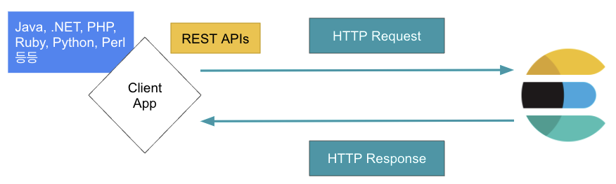

# [Elastic Stack] Elasticsearch 특징

---

# Elasticsearch란

[지난 포스팅](https://leediz.tistory.com/7)에서 Elastic Stack에 대해 무엇인지 간략하게 소개했다. 이번에는 **Elastic Stack의 심장**인 Elasticsearch에 대해 좀 더 알아보며 핵심 용어들에 대해 소개하겠다.

## Elasticsearch의 특징

### Apache Lucene 기반의 검색 엔진

  Elasticsearch는 [Apache Lucene]([https://lucene.apache.org](https://lucene.apache.org/))이라는 Java 기반의 검색 엔진 라이브러리이다. 여기서 `라이브러리` 의 의미는 Lucene을 사용하고 싶을 경우 말 그대로 라이브러리로 다운받아 import를 시켜야 Lucene의 API를 사용할 수 있다는 뜻이고, 개발단에서 코드레벨로써만 활용할 수 있다는 점이다. 따라서 Java 언어의 의존성이 심한 편이다. 뒤에서 설명하겠지만 Elasticsearch는 Lucene을 코어로 사용하여 추상화시켰기 때문에 개발단으로 사용할 필요도 없고, 프로그래밍 언어에 대한 의존성도 심하지 않다. 최근에는 Elasticsearch를 빅데이터 플랫폼 또는 분석 플랫폼으로 활용하고 있지만 어디까지나 Elasticsearch의 본질은 “검색 엔진”이다.

### 전문(Full Text) 검색 기능 제공

  전문(Full Text) 검색이란 “내용 전체를 색인하여 특정 단어가 포함된 문서를 검색”하는 것이다. 즉, 문서에서 특정 키워드에 대한 검색이 진행되야 하는 부분이다. 이것은 단순히 RDBMS에서 Like 검색을 통해 풀 스캔(Full-Scan)으로 특정 단어를 찾는 것과는 다른 부분이다. 검색 엔진과 RDBMS는 문장을 저장하는 자료구조에서 부터 차이가 있다. Elasticsearch의 경우에는 뒤에서 설명할 Invertex Index(역색인) 구조로 키워드를 저장하기 때문에 빠른 검색이 가능하다.

### 통계 분석이 가능

  Elasticsearch는 Query DSL이라는 별도의 쿼리 문법을 제공하는데, Aggregation이라는 통계 쿼리를 제공한다. 이를 통해 로그를 한 곳에 모아 통계 분석을 할 수 있고, 이를 토대로 키바나(Kibana)에서 시각화를 하여 대시보드를 그린다.

### REST API - 프로그래밍 언어 의존성이 크지 않음

  Elasticsearch는 모든 요청과 응답을 HTTP 통신을 통한 REST API를 지원하므로 Lucene과는 달리 프로그래밍 언어의 의존성 없이 다른 프로그래밍 언어들과 호환할 수 있다.

### Document-Oriented

  Document는 Elasticsearch에서 데이터가 저장되는 기본 단위로 JSON 형태이다. 하나의 Document는 여러 필드(field)와 값(value)를 갖는다. Elasticsearch는 Document 생성 시에 기본적인 메타데이터(metadata)들을 같이 저장하며 이를 통해 Document에 대한 버전 관리를 할 수 있다. 원칙적으로 Document는 불변형(Immutable) 구조로 저장되기 때문에 빈번한 수정이나 삭제는 성능에 안 좋은 영향을 준다.

### Inverted Index(역색인) 구조로 데이터 저장

  Elasticsearch가 검색엔진으로써 빠른 검색 성능을 보장하는 방법이다. Inverted Index는 종이책의 마지막 부분에서 제공하는 색인 페이지와 유사한 데이터 구조이다. 하지만 검색이 빠른 대신에 검색 시점에 Join Query를 할 수 없다는 단점도 있다. Inverted Index에 대한 예시는 아래와 같다.

- e.g.
    - doc1 - DATA 중심의 서비스와 스마트시스템 구축을 함께 합니다.
    - doc2 - 경험과 기술을 바탕으로 도전하고 혁신하는 서비스 전문기업
    - doc3 - DATA 관련 서비스가 필요한 모든 고객을 돕겠습니다.
        
        
        | 검색어(term) | 문서 | 검색어(term) | 문서 |
        | --- | --- | --- | --- |
        | data | doc1, doc3 | 중심의 | doc1 |
        | 서비스와 | doc1 | 스마트시스템 | doc1 |
        | 구축을 | doc1 | 함께 | doc1 |
        | 합니다 | doc1 | 경험과 | doc2 |
        | 기술을 | doc2 | 바탕으로 | doc2 |
        | 도전하고 | doc2 | 혁신하는 | doc2 |
        | 서비스 | doc2 | 전문기업 | doc2 |
        | 관련 | doc3 | 서비스가 | doc3 |
        | 필요한 | doc3 | 모든 | doc3 |
        | 고객을 | doc3 | 돕겠습니다 | doc3 |

  위 doc1, doc2, doc3 세 개의 문장이 있다. Elasticsearch는 저장 시에 별도의 설정을 하지 않는다면 `Standard Analyzer` 가 토큰화 작업을 한다. 따라서 Standard Analyzer에 의해 토큰화된 문장은 한국어에는 단순히 띄어쓰기(white space) 기준으로만 토큰화가 되어 저장되므로 위의 표와 같이 저장될 것이다. doc1의 문장에서 “Data”는 “data”로 소문자로 저장이 되며 나머지 단어들은 띄어쓰기 기준으로 토큰화되어 “중심의", “서비스와", “스마트시스템", “구축을", “함께”로 저장이 되며 마지막 토큰인 “합니다”는 구두점을 제거하여 저장이 된다. 각각의 토큰들은 어느 문장에 위치하는지 매칭이 되어 함께 저장이 된다. 이러한 원리에 의해 기존의 Index(색인) 저장 방식과는 반대로 저장하여 Inverted Index(역색인)라고 불린다. doc2와 doc3도 같은 원리를 적용하여 위와 같은 표의 구조로 저장된다. 검색에 있어서 매우 빠른 퍼포먼스를 보여주지만 한국어의 경우 전처리의 수준에 따라 의도한대로 검색이 되느냐 아니냐가 결정된다. 이 경우에는 “서비스"라는 단어를 검색하면 doc2만 검색이 된다. 하지만 일반적으로 “서비스"라는 단어를 검색하면 doc1, doc2, doc3가 다 검색이 되어야 할 것이다. 아래 표와 같이 저장이 되어야 의도한 대로 검색이 된다.

| 검색어(term) | 문서 | 검색어(term) | 문서 |
| --- | --- | --- | --- |
| data | doc1, doc3 | 중심 | doc1 |
| 서비스 | doc1, doc2, doc3 | 스마트시스템 | doc1 |
| 구축 | doc1 | 함께 | doc1 |
| 하다 | doc1, doc2 | 경험 | doc2 |
| 기술 | doc2 | 바탕 | doc2 |
| 도전 | doc2 | 혁신 | doc2 |
| 전문기업 | doc2 | 관련 | doc3 |
| 필요하다 | doc3 | 모든 | doc3 |
| 고객 | doc3 | 돕겠습니다 | doc3 |

  doc1의 문장을 보면 “data”, “중심", “서비스", “스마트시스템", “구축” “함께", “하다”로 각각의 단어들이 분리된다. “DATA”는 “data”로 소문자가 되고, “중심의", “서비스와", “구축을”은 각각 조사 “의", “와", “을”이 빠져 “중심", “서비스”, “구축"으로 명사화가 되었다. “합니다."의 경우에는 구두점을 제거하고 원형인 “하다"로 저장이 되었다. doc2와 doc3도 마찬가지로 대문자는 소문자로, 명사의 붙은 조사는 제거, 형용사는 원형으로 저장한다. 이 케이스에서는 “서비스"를 검색할 때 doc1, doc2, doc3가 다 검색이 된다. 

  Elasticsearch에서 한국어를 두번째 케이스같이 저장을 하려면 Custom Analyzer를 설정하거나 [Nori]([https://www.elastic.co/guide/en/elasticsearch/plugins/current/analysis-nori.html](https://www.elastic.co/guide/en/elasticsearch/plugins/current/analysis-nori.html)) 플러그인을 사용하여야 한다. 이에 대한 자세한 설명은 별도의 포스팅에서 진행할 예정이다.

## 마무리

  이번 포스팅에서는 Elasticsearch의 대표적인 특징에 대해서 알아봤다. 위에 서술한 특징 외에도 많은 특징들이 있지만 앞으로 차차 다른 포스팅을 통해 정리할 예정이다.

## 참고 자료

---

- [https://www.elastic.co/kr/elasticsearch/](https://www.elastic.co/kr/elasticsearch/)
- [http://www.yes24.com/Product/Goods/103030516](http://www.yes24.com/Product/Goods/103030516)
- [http://www.yes24.com/Product/Goods/71893929](http://www.yes24.com/Product/Goods/71893929)