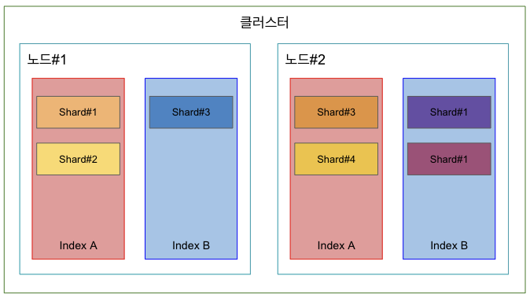

# [Elastic Stack] Elasticsearch 주요 용어

---

# Elasticsearch란

[지난 포스팅](https://leediz.tistory.com/13)에서 Elasticsearch에 대해 대표적인 특징에 대해 알아봤다. 이번 포스팅에서는 Elasticsearch에서 사용하는 주요 용어 일부에 대해 소개하겠다.

## Elasticsearch 주요 용어

### 노드 (Node)

  Elasticsearch는 노드(Node)라는 이름으로 실행이 된다. 또한 실행 중인 Elasticsearch를 인스턴스(instance)라고도 표현한다. 클러스터가 구성되는 단위이며 Elasticsearch가 설치되는 물리적 혹은 논리적 단위이다. 보통은 물리적인 서버(머신)에 노드 하나를 구성하는 방식을 권장하지만, 경우에 따라 단일 물리 서버에 복수개의 노드를 설치할 수도 있다. 클러스터에 구성된 노드들은 각각의 노드 이름을 가질 수 있으며, 서로 중복되지 않는 유일한 이름으로 지정해야 한다. (elasticsearch.yml 파일에서 **node.name** 부분, 나중에 별도의 포스팅에서 더 자세히 다루겠다.) 또한 각각의 노드들은 여러 역할을 할 수 있으며, 이에 대해서는 별도의 포스팅으로 설명할 예정이다. 위 그림에서는 클러스터 내의 2개의 노드가 있다는 것을 표현했다.

### 클러스터 (Cluster)

  Elasticsearch는 클러스터(Cluster) 단위로 실행이 되며, Elasticsearch 노드들의 집합을 클러스터라고 한다. 운영 환경에서는 여러 노드로 클러스터를 구성하겠지만, 테스트 또는 개발 환경에서는 단일 노드로 실행하기도 한다. 단일 노드로 실행하더라도 클러스터 단위로 실행이 된다. 당연한 이야기이지만 동일 클러스터로 구성할 때에는 같은 클러스터 이름으로 지정을 해줘야 하며, 각 노드간에 transport 통신이 가능한 상태여야 한다. 간혹 여러 노드로 클러스터를 구성할 때, 클러스터링이 잘 되지 않을 수도 있다. 이 때에는 노드별로 클러스터 이름이 잘 설정 되었는지, 노드간의 transport 통신이 잘 되고 있는지 확인해줘야 하며 각 노드의 로그를 확인하여 cluster_uuid가 동일한지 체크해줘야 한다. cluster_uuid가 다를 경우 데이터 디렉토리를 삭제하고 다시 클러스터링을 시도하는 것을 추천한다. 위 그림에서는 2개의 노드를 1개의 클러스터로 구성하여 실행하는 예제이다.

### 인덱스 (Index, Indices)

  Elasticsearch에서 인덱스란 하나의 논리적인 “저장 단위"라고 생각하는게 이해하기 편하다. RDBMS에서도 검색을 빠르게 하기 위한 “인덱스"라는 개념이 있지만 그것과는 완전히 다른 개념이기 때문에 분리해서 생각하는 것이 좋다. RDBMS와 굳이 비교해보자면 테이블(Table)에 해당한다. Elasticsearch는 분산처리가 가능하기 때문에 여러 노드에 걸쳐 데이터를 저장할 수 있다. 이렇게 분산 저장된 데이터의 묶음을 “인덱스" 라는 논리적인 단위로 부른다. 인덱스는 뒤에서 설명할 샤드(shard)라는 물리적인 단위로 나누어 저장하며 인덱스별로 최소 1개 이상의 샤드를 생성하여 저장한다. 위 그림에서는 각 인덱스가 노드 2개에 나뉘어 저장되어 있는 예제이다.

### 색인 (Indexing)

  색인이란 “Elasticsearch에 데이터를 저장하는 과정”을 뜻하며 말 그대로 인덱스를 만드는 과정이다. Elasticsearch는 검색엔진이므로 색인 과정에서 데이터를 잘 검색할 수 있는 역색인 구조(Inverted Index)로 변환하여 저장할 뿐만 아니라 특별히 지정하지 않으면 Elasticsearch의 standard analyzer를 사용하여 각 단어에 대해 전처리를 하고 저장한다.

### 샤드 (Shard)

  Elasticsearch의 인덱스가 물리적으로 노드에 나뉘어져 저장되는 단위이다. 샤드라는 단위로 나누어 저장하기 때문에 Elasticsearch는 분산처리가 가능하며 확장성이 높을 뿐만 아니라 검색 성능의 이점을 가져가며 고가용성도 보장한다. 이번 포스팅은 Elasticsearch의 주요 용어에 대한 소개를 하는 포스팅이므로 샤드에 대한 자세한 설명은 다른 포스팅에서 다루겠다. (샤드에 대해서만 집중적으로 설명해도 내용이 많다.) 위 예제에서 Index A는 4개의 샤드로 나누어 저장되며 노드가 총 2대이므로 각각의 노드가 2개씩의 샤드를 저장하고 있다. Index B는 3개의 샤드로 나누어 저장되며 노드가 총 2대이므로 1번 노드는 1개의 샤드를 저장하고 있고 2번 노드는 2개의 샤드를 저장하고 있다.

### 문서 (Document, 도큐먼트)

  Elasticsearch에서 데이터가 저장되는 최소 단위이다. RDBMS와 굳이 비교를 해보면 레코드(Record) 또는 행(Row)에 해당하는 개념이다. 2차원 테이블이 아닌 JSON Object 형식으로 저장되며 RDBMS보다는 자유로운 포맷으로 저장을 할 수 있다. 예를 들어 Object 내에 Object를 저장하는 Nested 구조 또는 Array 형식 등으로 저장할 수 있다. 뿐만 아니라 각 도큐먼트는 동일한 필드 개수를 맞춰 저장할 필요가 없다. 위 예제에는 인덱스 내에 3개의 도큐먼트가 저장되어 있는 예제이며 2개의 도큐먼트는 3개의 필드를 갖고 있지만, 1개의 도큐먼트는 2개의 필드만 갖고 있다.

  영문으로 “Document”라고 표시되어 한국어로는 “문서"라고 번역이 될 수 있으나 개인적으로는 영문 그대로 “도큐먼트”라고 부르는 것이 더 익숙하여 앞으로는 굳이 문서라고 표현하지 않고 도큐먼트라고 하겠다.

### 필드 (Field)

  도큐먼트(Document)를 구성하는 속성이다. 도큐먼트가 JSON 포맷으로 저장되기 때문에 자연스럽게 필드는 Key-Value 형식으로 저장이 된다. RDBMS와 비교를 해보면 열(Column)에 해당하는 개념이다. Elasticsearch의 필드는 1개 이상의 타입을 가질 수 있어서 멀티 필드로 구성할 경우 하나의 필드에 여러 타입으로 저장을 하여 활용할 수 있다. 이 또한 별도의 포스팅으로 자세히 다룰 예정이다.

### 매핑 (Mapping)

  도큐먼트의 필드에 대한 데이터 타입과 저장 방법을 정의하는 프로세스이다. RDBMS에서는 DDL로 테이블을 정의해야 하지만, Elasticsearch는 도큐먼트의 필드 타입을 정의하지 않아도 Elasticsearch가 추론을 하여 데이터 타입을 정하여 저장한다. 데이터 타입이 없는 것이 아니다. 물론 이 기능은 의도와 다르게 데이터 타입이 지정되고 저장될 수 있으므로 운영 환경에서는 권장되지 않는 사항이다. 다만, 미처 알지 못했던 필드가 데이터로 저장될 경우에도 에러 없이 유연하게 저장이 된다는 장점이 있다.

- 위에서 Elasticsearch와 RDBMS를 비교한 것을 정리한 표이다.

> 간혹 블로그 글들에서 Elasticsearch의 타입(Type)에 대해 다루며 RDBMS와 비교하는 글을 볼 수 있다. 이것은 6.1 이전의 Elasticsearch에 해당하는 내용으로 6.1 이후 버전부터 현 시점 기준 7.16.3 버전에서는 Elasticsearch의 타입은 `_doc` 타입으로 유일하게 저장되므로 따로 신경쓸 필요가 없다.
> 

## 마무리

  이번 포스팅에서는 Elasticsearch의 대표적인 특징에 대해서 알아봤다. 위에 서술한 특징 외에도 많은 특징들이 있지만 앞으로 차차 다른 포스팅을 통해 정리할 예정이다.

## 참고 자료

---

- [https://www.elastic.co/kr/elasticsearch/](https://www.elastic.co/kr/elasticsearch/)
- [http://www.yes24.com/Product/Goods/103030516](http://www.yes24.com/Product/Goods/103030516)
- [http://www.yes24.com/Product/Goods/71893929](http://www.yes24.com/Product/Goods/71893929)